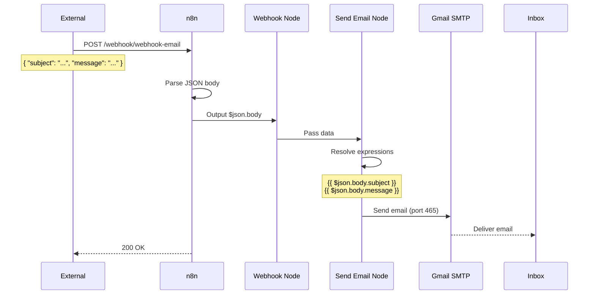

# Webhook to Email — n8n Workflow

A production-ready webhook that receives JSON data via HTTP POST and forwards it as an email via Gmail SMTP.

## Architecture

```
┌─────────────────┐     POST JSON      ┌──────────────┐     SMTP      ┌─────────┐
│  External App   │ ──────────────────▶ │  n8n Server  │ ────────────▶ │  Gmail  │
│  (curl, API)    │    https://.../     │              │    port 465  │  Inbox  │
└─────────────────┘    webhook-email    └──────────────┘              └─────────┘
                                              │
                                              │ 2 nodes connected
                                              ▼
                              ┌──────────────────────────────┐
                              │         Workflow Canvas       │
                              │                               │
                              │  [Webhook] ──▶ [Send Email]   │
                              │                               │
                              └──────────────────────────────┘
```

## Nodes

### 1. Webhook (Trigger)

- **Type**: `n8n-nodes-base.webhook`
- **Method**: `POST`
- **Path**: `/webhook-email`
- **Full URL**: `https://n8n-production-509b.up.railway.app/webhook/webhook-email`

This is the entry point. It listens for incoming HTTP POST requests. When a request arrives, it captures the JSON body and passes it to the next node.

### 2. Send Email (Action)

- **Type**: `n8n-nodes-base.emailSend`
- **Credentials**: Gmail SMTP (smtp.gmail.com:465)
- **From**: `micro.anish29801@gmail.com`
- **To**: `micro.anish29801@gmail.com`

This node takes data from the Webhook and sends an email. The subject and body use n8n expressions to extract values from the incoming JSON.

## Data Flow

### Input (POST request)

```json
{
  "subject": "Server Alert",
  "message": "CPU usage exceeded 90%"
}
```

### How n8n processes it

1. Webhook node receives the POST → parses JSON → outputs the data as `$json.body`
2. Send Email node reads the expression `{{ $json.body.subject }}` → evaluates to `"Server Alert"`
3. Same for `{{ $json.body.message }}` → evaluates to `"CPU usage exceeded 90%"`
4. Connects to Gmail SMTP (port 465, SSL) with the stored credentials
5. Sends the email to the configured recipient

### Output (email received)

| Field     | Value                              |
|-----------|------------------------------------|
| From      | micro.anish29801@gmail.com         |
| To        | micro.anish29801@gmail.com         |
| Subject   | New alert: Server Alert            |
| Body      | CPU usage exceeded 90%             |

## Credentials

Stored in n8n's encrypted credential store (`Gmail SMTP`):

| Setting     | Value                        |
|-------------|------------------------------|
| Host        | smtp.gmail.com               |
| Port        | 465                          |
| SSL         | ON                           |
| Username    | micro.anish29801@gmail.com   |
| Password    | qnvs fjck yelw mhit (App Password) |

> **Why App Password?** Gmail requires an App Password (not your regular password) when using SMTP with 2FA enabled. Generated at https://myaccount.google.com/apppasswords.

## Flow Diagram (Mermaid)



## How to Test

### curl (PowerShell)

```powershell
$body = '{"subject":"Test Alert","message":"Hello from n8n!"}' | Out-File temp.json
curl -X POST https://n8n-production-509b.up.railway.app/webhook/webhook-email -H "Content-Type: application/json" -d @temp.json
```

### curl (Linux/Mac)

```bash
curl -X POST https://n8n-production-509b.up.railway.app/webhook/webhook-email \
  -H "Content-Type: application/json" \
  -d '{"subject":"Test Alert","message":"Hello from n8n!"}'
```

### Python

```python
import requests

r = requests.post(
    "https://n8n-production-509b.up.railway.app/webhook/webhook-email",
    json={"subject": "Test Alert", "message": "Hello from n8n!"}
)
print(r.text)  # "Workflow was started"
```

### Expected Response

```
Workflow was started
```

## Deployment Details

| Component          | Value                                                      |
|--------------------|------------------------------------------------------------|
| Platform           | Railway (https://railway.app)                              |
| Docker Image       | `n8nio/n8n`                                                |
| n8n Version        | 2.28.6                                                     |
| Database           | PostgreSQL (managed by Railway)                            |
| Persistent Volume  | `/home/node/.n8n` (500 MB)                                 |
| Public URL         | https://n8n-production-509b.up.railway.app                 |
| Workflow ID        | `ht6GUQGA0fFd5Vh2`                                         |

## Expressions Reference

n8n uses `{{ }}` for expressions. When the Webhook receives JSON like `{"body": {"subject": "hi"}}`, the data is accessed as:

| Expression                     | Resolves To                      |
|--------------------------------|----------------------------------|
| `{{ $json.body.subject }}`     | Value of `subject` field         |
| `{{ $json.body.message }}`     | Value of `message` field         |
| `{{ $json.headers }}`          | HTTP request headers             |
| `{{ $json.query }}`            | Query parameters                 |
| `{{ $json.body }}`             | Entire JSON body                 |

## Troubleshooting

| Problem                      | Cause                          | Fix                                    |
|------------------------------|--------------------------------|----------------------------------------|
| Webhook returns 422          | Malformed JSON in POST body    | Validate JSON with `json_verify`       |
| Webhook returns 404          | Workflow not active            | Toggle Active switch in editor         |
| Email not sent               | Wrong SMTP password            | Regenerate Gmail App Password          |
| "Unrecognized node type"     | Wrong node type name used      | Use `n8n-nodes-base.emailSend`         |
| Gmail "Login attempt blocked"| App Password rejected          | Generate new App Password at Google    |

## Security Notes

- The webhook URL is public — anyone with the URL can trigger it
- SMTP credentials are encrypted at rest in n8n's database
- Basic Auth is enabled on the n8n editor (admin / ySOZVt4m37xLaRWG0Po1s6Eg)
- Credentials backup stored in `.env.local` (keep this file secure)
